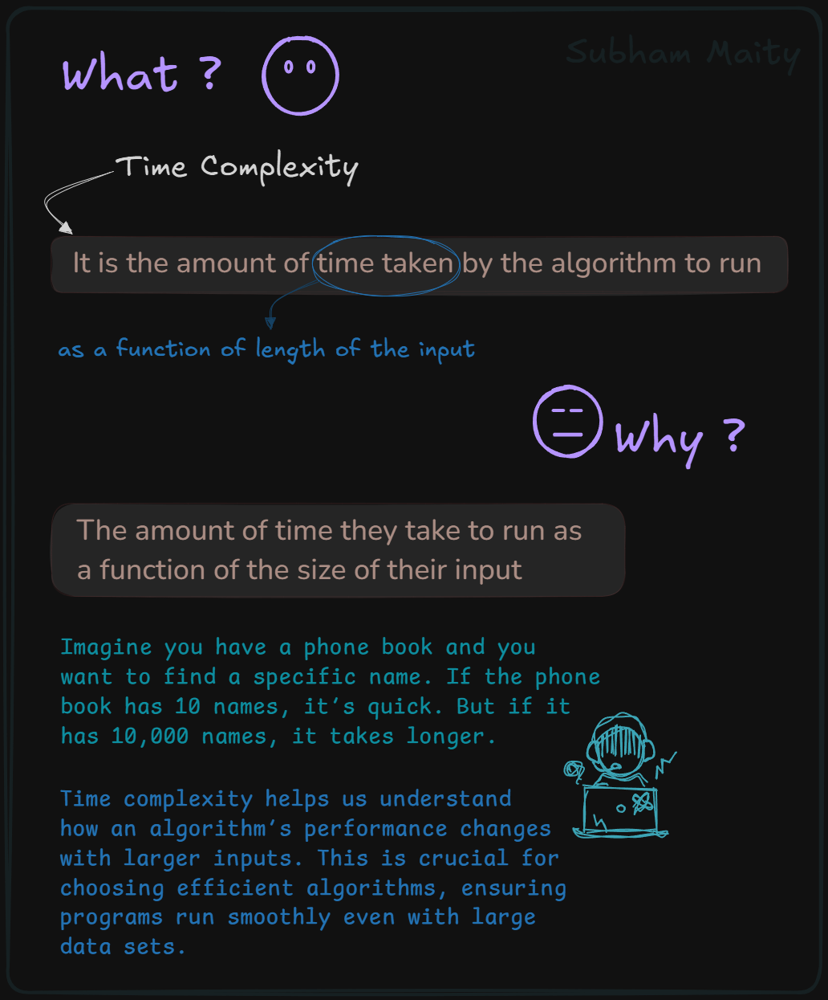
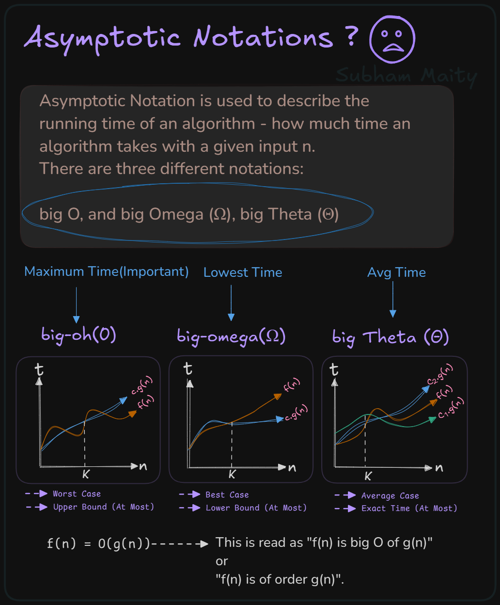
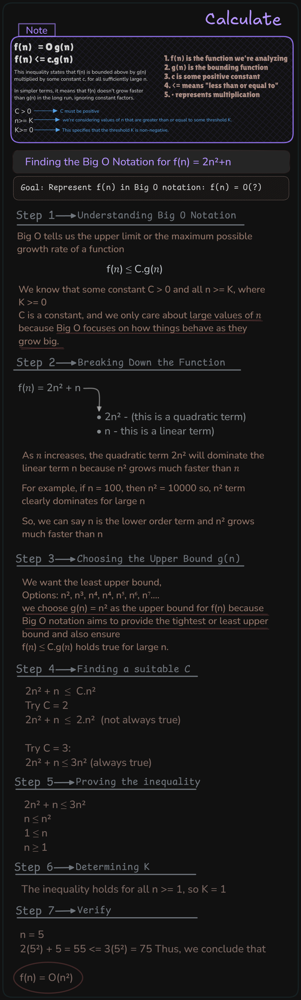
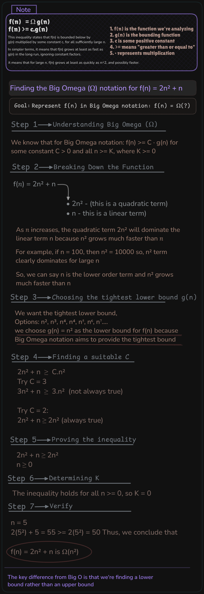
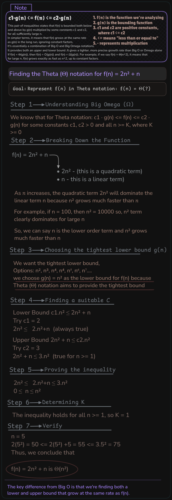
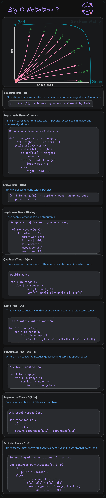

# Time & Space Complexity  

- [Concept:](#concept)
- [Easy Big O Calculation Rules:](#easy-big-o-calculation-rules)
- [How to calculate program's time complexity:](#how-to-calculate-programs-time-complexity)
- [Constraints:](#constraints)
- [What is space complexity:](#space-complexity)
- [How to calculate program's space complexity:](#how-to-calculate-programs-space-complexity)
- [Tips and Tricks for Analyzing Space Complexity:](#tips-and-tricks-for-analyzing-space-complexity)
## Concept:








## Easy Big O Calculation Rules:
1. Ignore lower degree terms
2. Ignore constants

Corrected and formatted calculations:

1. f(n) = 2n² + 3n → O(n²)

2. f(n) = 4n⁴ + 3n³ → O(n⁴)

3. f(n) = n² + log n → O(n²)

4. f(n) = 3n³ + 2n² + 5 → O(n³)

5. f(n) = n³/300 → O(n³)

6. f(n) = 5n²/log n → O(n²)

7. f(n) = n/4 → O(n)

8. f(n) = (n+4)/4 → O(n)

Key points:
- The highest degree term determines the Big O notation.
- Constant coefficients (like 2, 3, 4, 1/300, etc.) are ignored.
- Lower degree terms (like n² when n³ is present) are ignored.
- Logarithmic terms are considered lower order than polynomial terms.
- Division by a constant (like /4) doesn't affect the Big O notation.
- Division by a logarithmic term (like /log n) doesn't change the polynomial degree in Big O notation.


## How to calculate program's time complexity

### 1. Print Array
```cpp
void printArray(int arr[], int n) {
    for(int i = 0; i < n; i++) {
        cout << arr[i] << " ";
    }
    cout << endl;
}
```
- **Explanation**: The loop runs from 0 to `n`, meaning it iterates `n` times.
- **Time Complexity**: O(n)

### 2. Reverse an Array
```cpp
void reverse(int arr[], int n) {
    int start = 0;
    int end = n - 1;
    while (start <= end) {
        swap(arr[start], arr[end]);
        start++;
        end--;
    }
}
```
- **Explanation**: The loop swaps elements from both ends until the middle. This results in approximately `n/2` swaps. Since constants are ignored in Big-O notation, it simplifies to O(n).
- **Time Complexity**: O(n)

### 3. Linear Search
```cpp
int linearSearch(int arr[], int n, int x) {
    for (int i = 0; i < n; i++) {
        if (arr[i] == x) {
            return i; 
        }
    }
    return -1;
}
```
- **Explanation**: In the worst case, we may have to check every element of the array, which requires `n` comparisons.
- **Time Complexity**: O(n)

### 4. Separate Loops
```cpp
int a = 0, b = 0;
for (int i = 0; i < N; i++) {
    a = a + rand();
}
for (int j = 0; j < M; j++) {
    b = b + rand();
}
```
- **Explanation**: The first loop runs `N` times and the second loop runs `M` times. Since these are independent loops, their complexities add up.
- **Time Complexity**: O(N) + O(M) = O(N + M)

### 5. Nested Loop with Independent Loop
```cpp
int a = 0, b = 0;
for (int i = 0; i < N; i++) {
    for (int j = 0; j < N; j++) {
        a = a + j;
    }
}

for (int k = 0; k < N; k++) {
    b = b + k;
}
```
- **Explanation**: The first part has a nested loop that runs `N * N` times, so it has a time complexity of O(N²). The second part has a single loop that runs `N` times.
- **Time Complexity**: O(N²) + O(N) = O(N²)

### 6. Nested Loop with Varying Inner Loop
```cpp
int a = 0;
for (int i = 0; i < N; i++) {
    for (int j = N; j > i; j--) {
        a = a + i + j;
    }
}
```
- **Explanation**: The outer loop runs `N` times. The inner loop runs `N - i` times, which decreases as `i` increases. This results in a quadratic time complexity because the total number of iterations is proportional to the sum of a series.
- **Time Complexity**: O(N²)

### 7. Get Minimum and Maximum from Array
```cpp
#include<iostream>
using namespace std;

int getMin(int num[], int n) {
    int min = INT_MAX;
    for(int i = 0; i < n; i++) {
        if(num[i] < min) {
            min = num[i];
        }
    }
    return min;
}

int getMax(int num[], int n) {
    int max = INT_MIN;
    for(int i = 0; i < n; i++) {
        if(num[i] > max) {
            max = num[i];
        }
    }
    return max; 
}
```
- **Explanation**: Both `getMin` and `getMax` iterate through the array exactly once, performing a comparison at each step.
- **Time Complexity**: O(n) for both functions.


## Constraints

### 1. **Basic Benchmark: 10^8 Operations/Second**
Modern computers can generally perform around **10^8 operations per second**. This is the benchmark for time complexity decisions. Based on this, we estimate what kind of algorithms will perform well given certain input sizes.

### 2. **Input Size Constraints**
You'll often see input size constraints like:

- **1 ≤ n ≤ 1000**
- **1 ≤ n ≤ 10^6**
- **1 ≤ n ≤ 10^9**

Each range influences which time complexity is acceptable.

#### **Case 1: 1 ≤ n ≤ 1000**
- For small input sizes (up to 1000), algorithms with time complexities up to **O(n²)** are usually acceptable.
- Example: If `n = 1000`, an O(n²) algorithm would perform at most **1000² = 10^6 operations**, which is feasible since it's under 10^8.

**Suitable time complexities**:
- O(n)
- O(n log n)
- O(n²)

**Avoid**:
- O(2ⁿ), O(n!), etc., as they grow extremely fast.

#### **Case 2: 1 ≤ n ≤ 10^6**
- This is a more common constraint in competitive programming. For `n` values up to 10^6, algorithms with time complexities around **O(n log n)** are generally acceptable.
- Example: If `n = 10^6`, an O(n log n) algorithm would perform roughly **10^6 * log(10^6) ≈ 2 × 10^7 operations**, which is under the 10^8 threshold.

**Suitable time complexities**:
- O(n)
- O(n log n)

**Avoid**:
- O(n²) (as 10^6² = 10^12 operations would take too long).

#### **Case 3: 1 ≤ n ≤ 10^9**
- This is a large input size, and here you need to ensure that your algorithm runs in **O(n)** or better, such as **O(log n)**.
- Example: For `n = 10^9`, an O(n) algorithm would perform **10^9 operations**, which is close to the upper limit but feasible. However, O(n log n) algorithms might exceed the time limit.

**Suitable time complexities**:
- O(n)
- O(log n)
- O(1)

**Avoid**:
- O(n log n) and higher, such as O(n²), O(2ⁿ), and O(n!).


### 3. **Common Time Complexities and Their Feasibility**
Here’s a summary of how different time complexities behave relative to the input size:

- **O(1)**: Constant time, the fastest. Suitable for any input size.
- **O(log n)**: Efficient even for very large inputs (e.g., binary search). Suitable up to `n = 10^9` or higher.
- **O(n)**: Linear time, acceptable for inputs up to `n = 10^9`.
- **O(n log n)**: Slightly slower but often used for sorting algorithms. Suitable for `n` up to `10^6`.
- **O(n²)**: Quadratic time, becomes infeasible beyond `n = 1000`. Suitable only for small inputs.
- **O(2ⁿ)**: Exponential time, infeasible beyond very small values of `n` (e.g., `n > 20`).
- **O(n!)**: Factorial time, grows extremely fast. Suitable only for very small `n` (e.g., `n ≤ 10`).


### 4. **Guidelines for Choosing Time Complexity Based on Input Size**
- **For 1 ≤ n ≤ 100**: You can afford slower algorithms like O(n²) or even O(2ⁿ).
- **For 1 ≤ n ≤ 1000**: O(n²) is acceptable, but avoid exponential growth algorithms.
- **For 1 ≤ n ≤ 10^6**: Aim for O(n log n) or faster (O(n)).
- **For 1 ≤ n ≤ 10^9**: Stick to O(n) or O(log n) algorithms to ensure your solution runs within the time limit.


### 5. **Example Scenarios**
1. **Sorting an Array**
    - Input size: `1 ≤ n ≤ 10^5`
    - A sorting algorithm like **Merge Sort (O(n log n))** is feasible because `n log n` for `n = 10^5` would yield approximately **2 × 10^6 operations**, which is well within the limit.

2. **Finding Pairs in an Array (Brute Force)**
    - Input size: `1 ≤ n ≤ 10^6`
    - A brute-force O(n²) solution would perform **10^12 operations** for `n = 10^6`, which would exceed time limits. Instead, use a more efficient approach, like a two-pointer technique or hashing, to reduce the time complexity to O(n).

3. **Binary Search on a Sorted Array**
    - Input size: `1 ≤ n ≤ 10^9`
    - A binary search (O(log n)) would perform at most **30 operations** for `n = 10^9`, making it extremely efficient.


## Space Complexity

Space complexity refers to the amount of extra memory (space) required by the algorithm, aside from the input data. It is typically expressed in terms of the input size `n`.

- **O(1)**: Constant space, meaning the space required does not grow with input size.
- **O(n)**: Linear space, meaning the space grows linearly with the input size.

A simple trick to analyze space complexity:
- Look at the memory used by **variables**, **arrays**, and **recursion**.
- Only count **extra space** beyond the input size.

## How to calculate program's space complexity

### 1. **Print Array**
```cpp
void printArray(int arr[], int n) {
    for(int i = 0; i < n; i++) {
        cout << arr[i] << " ";
    }
    cout << endl;
}
```

- **Explanation**: This function does not use any additional space beyond the input array `arr`. It only uses the input size and a few variables like `i`, which take constant space.
- **Space Complexity**: **O(1)** (constant space)


### 2. **Reverse an Array**
```cpp
void reverse(int arr[], int n) {
    int start = 0;
    int end = n - 1;
    while (start <= end) {
        swap(arr[start], arr[end]);
        start++;
        end--;
    }
}
```

- **Explanation**: The function modifies the array in place, so no additional memory is used apart from the input array and a few constant variables (`start`, `end`).
- **Space Complexity**: **O(1)** (constant space)


### 3. **Linear Search**
```cpp
int linearSearch(int arr[], int n, int x) {
    for (int i = 0; i < n; i++) {
        if (arr[i] == x) {
            return i; 
        }
    }
    return -1;
}
```

- **Explanation**: The function uses only a constant amount of extra space (loop variable `i`), so no additional memory is allocated other than the input array.
- **Space Complexity**: **O(1)** (constant space)


### 4. **Separate Loops**
```cpp
int a = 0, b = 0;
for (int i = 0; i < N; i++) {
    a = a + rand();
}
for (int j = 0; j < M; j++) {
    b = b + rand();
}
```

- **Explanation**: The loops do not use any additional memory, aside from the two variables `a` and `b` and the loop counters `i` and `j`. All of these take constant space.
- **Space Complexity**: **O(1)** (constant space)


### 5. **Nested Loop with Independent Loop**
```cpp
int a = 0, b = 0;
for (int i = 0; i < N; i++) {
    for (int j = 0; j < N; j++) {
        a = a + j;
    }
}
for (int k = 0; k < N; k++) {
    b = b + k;
}
```

- **Explanation**: Similar to the previous examples, the only extra memory used is for variables (`a`, `b`, `i`, `j`, `k`). No additional arrays or complex data structures are created.
- **Space Complexity**: **O(1)** (constant space)


### 6. **Nested Loop with Varying Inner Loop**
```cpp
int a = 0;
for (int i = 0; i < N; i++) {
    for (int j = N; j > i; j--) {
        a = a + i + j;
    }
}
```

- **Explanation**: The space complexity remains constant because only a few variables (`a`, `i`, `j`) are used. There is no additional data storage.
- **Space Complexity**: **O(1)** (constant space)


### 7. **Get Minimum and Maximum from Array**
```cpp
#include<iostream>
using namespace std;

int getMin(int num[], int n) {
    int min = INT_MAX;
    for(int i = 0; i < n; i++) {
        if(num[i] < min) {
            min = num[i];
        }
    }
    return min;
}

int getMax(int num[], int n) {
    int max = INT_MIN;
    for(int i = 0; i < n; i++) {
        if(num[i] > max) {
            max = num[i];
        }
    }
    return max; 
}
```

- **Explanation**: Both functions use a single variable (`min` or `max`) and iterate over the array without requiring any extra memory allocation. The input array is not duplicated or changed.
- **Space Complexity**: **O(1)** (constant space)


## **Tips and Tricks for Analyzing Space Complexity**
1. **Look for Recursion**: Recursive algorithms often use extra memory for the call stack. If a function calls itself `n` times, the space complexity might be **O(n)** due to the recursive stack.

2. **Check for Additional Data Structures**: If your algorithm creates extra arrays, lists, or other data structures, it increases space complexity. For example:
   - Storing a copy of an array → **O(n)**
   - Using a hash table → **O(n)**

3. **In-Place Algorithms**: Algorithms that modify the input directly, without using additional space, typically have **O(1)** space complexity.

4. **Helper Arrays or Variables**: If the algorithm uses an extra array of size `n`, the space complexity is **O(n)**. If it uses just a few variables, the space complexity is **O(1)**.


| Algorithm                                | Time Complexity | Space Complexity |
|------------------------------------------|-----------------|------------------|
| Print Array                              | O(n)            | O(1)             |
| Reverse an Array                         | O(n)            | O(1)             |
| Linear Search                            | O(n)            | O(1)             |
| Separate Loops                           | O(N + M)        | O(1)             |
| Nested Loop with Independent Loop        | O(N²)           | O(1)             |
| Nested Loop with Varying Inner Loop      | O(N²)           | O(1)             |
| Get Minimum and Maximum from Array       | O(n)            | O(1)             |

